# INTERNET OF THINGS
# TECHNOLOGY & HARDWARE ARCHITECTURE

# 1.Mô hình hệ thống

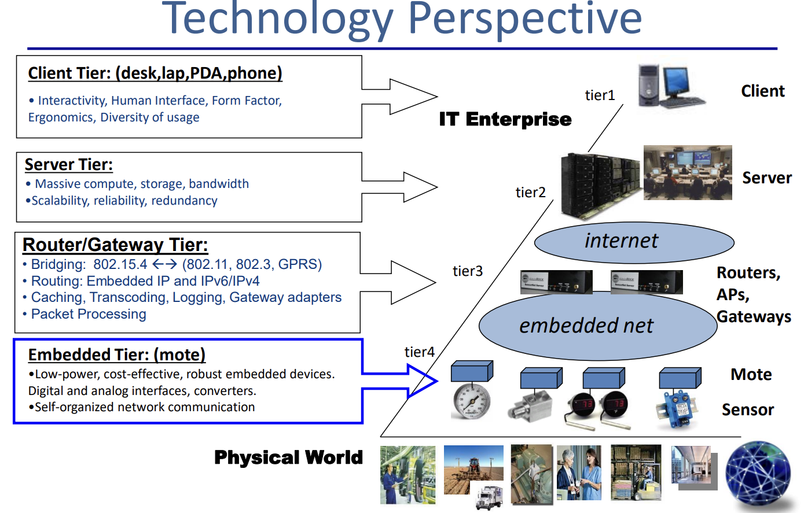

## 1.1.Embedded Tire

Physical World (Thế giới thực) cần các nút mạng cảm biến để thu thập dữ liệu, các nút mạng này được gọi là Sensor node hay Mote.

Tập hợp những Mote kết nối lại với nhau tại thành Embedded Tire.

Đặc điểm của Embedded Tire là:

- Các Mote là một thiết bị nhúng với chức năng chính là xử lý dữ liệu của Physical World thông qua các sensor được tích hợp với nó. (Các loại sensor xử lý dữ liệu của: độ ẩm, lưu lượng nước, nhiệt độ, ánh sáng, bức xạ, góc nghiêng, tracking vật thể/người, y sinh, tốc độ, lưu lượng nước, công suất,…).
- Kết nối theo mô hình Ad-Hoc Network: các Mote tổ chức kết nối tự động, tự hình thành Network, không cần điều phối khi bật nguồn.
- Ràng buộc của Mote: tiêu thụ công suất thấp, chi phí thấp, có interface đáp ứng cho mục đích giao tiếp với sensor và giao tiếp với các Mote khác cũng như giao tiếp với Router/Gateway tire.

## 1.2.Router/Gateway Tire

Dữ liệu từ các Mote của Embedded Tire được gửi đến Gateway (Router/Gateway).

Router/Gateway Tire có hai giao tiếp chính: giao tiếp với Mote Network của Embedded Tire và giao tiếp với Server thông qua Internet.

Tập hợp các Routers, Access Points và Gateways là Router/Gateway Tire.

- Bridging: sử dụng chuẩn giao tiếp 802.15.4 (LR-WPAN) cho Embedded Tire; các chuẩn 802.11 (Wireless Network), 802.3 (LAN), GPRS, NB-IoT.
- Routing: Embedded IP và Ipv6/Ipv4.
- Chức năng: caching (đệm), transcoding(xử lý gói tin), logging (ghi nhận các hoạt động của WSN), Gateway adapter (tạo bộ giao thức truyền).

## 1.3.Server Tire

Gói tin của Router/Gateway Tire sẽ được gửi và lưu trữ ở Server Tire.

Học ở môn Mạng máy tính.

## 1.4.Client Tire

Người dùng sẽ truy cập vào Server để xem thông tin, gửi lệnh điều khiển đến hệ thống bên dưới.

# 2.Cấu tạo của Mote

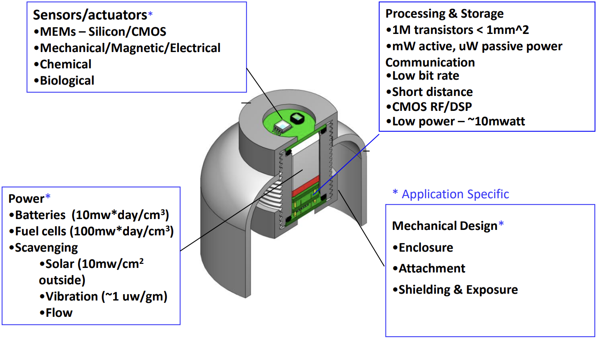

## 2.1.Sensor/actuators

Cảm biến (Sensor) sử dụng công nghệ MEMs hay Silicon/CMOS. Mục đích dùng để đo các đại lượng vật lý từ thế giới bên ngoài.

Các loại sensor xử lý các đại lượng như: độ ẩm, lưu lượng nước, nhiệt độ, ánh sáng, bức xạ, góc nghiêng, tracking vật thể/người, y sinh, tốc độ, lưu lượng nước, công suất,…

Actuators là các bộ kích khởi, truyền động.

## 2.2.Mechanical Design

Lớp vỏ bảo vệ bên ngoài cho toàn bộ hệ thống bên trong. Học ở môn Thiết kế sản phẩm công nghiệp.

## 2.3.Processing and Storage

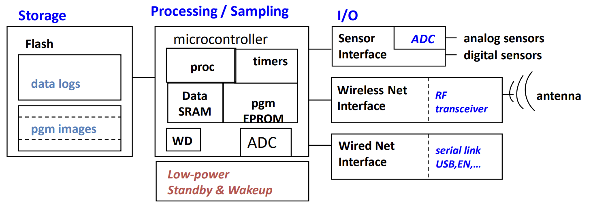

### 2.3.1. Storage – Flash

- data logs: lưu dữ liệu đọc của sensor.
- pgm image: FOTA lưu firmware để đưa vào pgm EPROM của microcontroller.

### 2.3.2. Processing/Sampling – Microcontroller

- Peripheral: GPIO, Timer, ADC,…
- Data SRAM: bộ nhớ dùng trong lúc thực thi chương trình.
- pgm EPROM: lưu chương trình.
- WD (Watch-dog): reset mote khi crash.
- Low-power mode.

### 2.3.3. Interface and communication

- Wireless Net Interface: giao tiếp với các nút mạng cảm biến.
- Wired Net Interface (serial link, USB, EN,…): mục đích chính là để lập trình firmware cho microcontroller, hoặc biến Mote này thành Base station giao tiếp với các nút mạng cảm biến khác.
- Sensor interface.

### 2.3.4. Ràng buộc

- Có chức năng low power mode, công suất tiêu thụ lúc hoạt động ở mW, công suất tiêu thụ trong low power mode ở uW.
- Communication: đảm bảo tiêu tốn năng lượng thấp công suất truyền thấp (tối đa 7dBm, ~10mW) khoảng cách truyền ngắn, low bit rate.

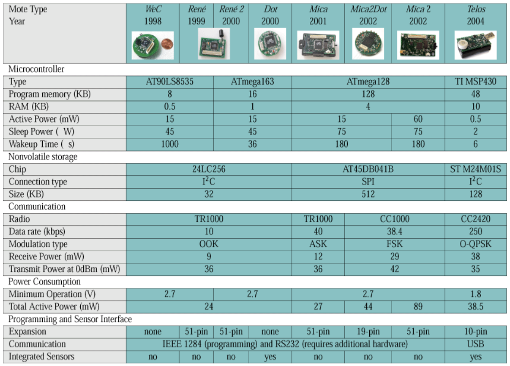

## 2.4.Power

Xét trường hợp sử dụng pin AA và Cell pin cho các hệ thống mạng sau:

- 2 Pin AA có dung lượng khoảng 1.5Ah (khoảng 4Wh)
- 1 Cell pin có dung lượng khoảng 1Ah (khoảng 3.5Wh)

Cellular Network: 500mW – 1000mW dùng được vài giờ.

Wifi: 300mW – 500mW dùng được trong ngày.

GPS: 50mW – 100mW dùng được vài ngày.

Mục tiêu đặt ra cho hệ thống WSN là hoạt động từ 6 tháng đến 1 năm:

WSNs: 50mW active, 20uW low-power mode.

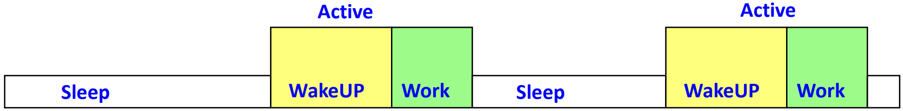

Average power consumption: $P_{ave} = (1 - f_{active}) \times P_{sleep} + f_{active} \times P_{active}$

Lifetime: $EnergyStore/(P_{active} - P_{generate})$

# 3.RF Technology

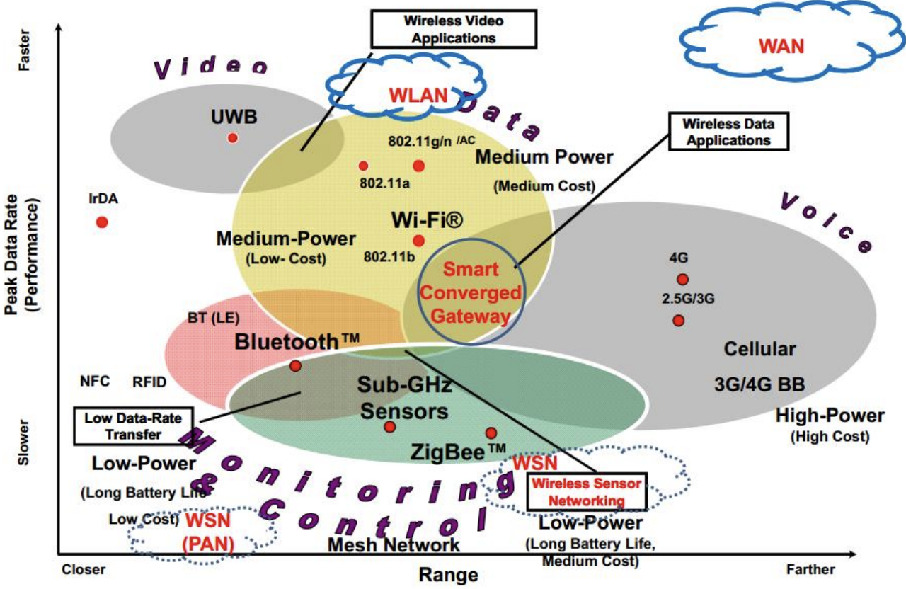

Wireless Sensor Networking (WSN): khoảng cách vừa, tốc độ thấp.

Công suất tiêu thụ thấp, tốc độ truyền dữ liệu thấp, tự khởi tạo hệ thống mạng.

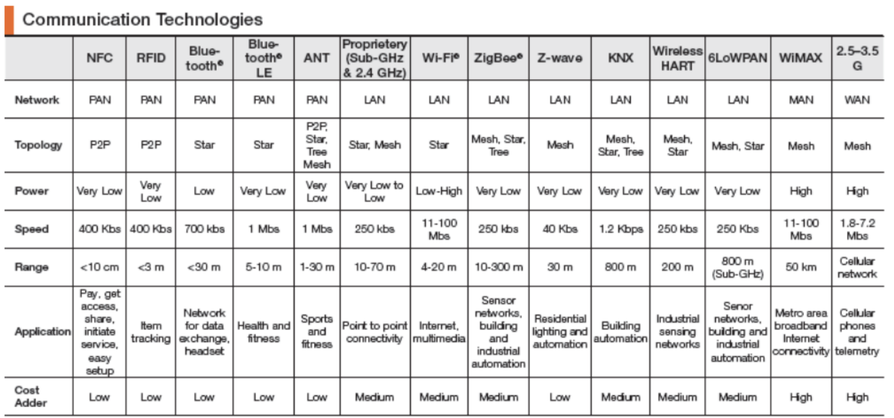

# 4.IEEE 802.15.4

IEEE802.15.4 là tiêu chuẩn nền tảng của mạng cảm biến không dây, có tên là Low-rate Wirelse Personal Area Network (LR-WPAN). Tiêu chuẩn này quy ước cho hai lớp Physical Layer và MAC.

Chia băng tần cho Physical Layer như sau:

- 868.0MHz – 868.6MHz: Euroup, cho phép sử dụng một kênh duy nhất.
- 920MHz – 928MHz: Bắc Mỹ, 10 channels, up to 30 channels.
- 2.4GHz – 2.4835GHz: toàn cầu, up to 26 channels.

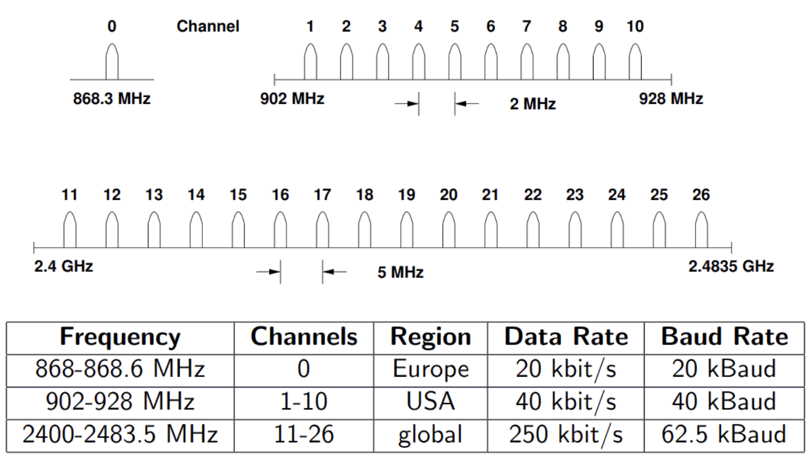

Sử dụng băng tần 2.4GHz – 2.4835GHz do áp dụng cho toàn cầu. Lưu ý chọn channel mà wifi và bluetooth sử dụng cùng băng tần ít ảnh hưởng tới.

## 4.1.Device classes

Các end-device ở IEEE 802.15.4 được chia thành hai loại:

| Full Function Device (FFD) | Reduce Function Device (RFD) |
| --- | --- |
| Thiết bị có khả năng định tuyến (routing), giao tiếp với toàn bộ end-device khác. Cấu hình thiết bị tương đối lớn. Sử dụng bộ đệm lớn (Selective Repeat) | Thiết bị chỉ có kết nối P2P với FFD, không có khả năng định tuyến. Cấu hình thiết bị đơn giản hơn FFD. Sử dụng bộ đệm nhỏ (Go-Back N) |

Dựa vào mô hình Go-Back N cho RFD và Selective Repeat cho FFD giúp giảm chi phí WSNs.

Các loại thiết bị trong WSNs:

| Coordinator | PAN Coordinator | Network Device |
| --- | --- | --- |
|Luôn là FFD. Nhận dữ liệu từ Network Device. Chuyển dữ liệu cho node tiếp theo hoặc PAN Coordinator.|Chỉ tồn tại duy nhất 1 PAN Coordinator trong WSN. Điều khiển toàn bộ PAN của WSNs. Thông thường gắn với máy tính, hoặc đưa dữ liệu ra ngoài. Đóng vai trò như Base station.| Có thể là FFD hoặc RFD. Được thiết lập theo chuẩn IEEE 802.15.4 MAC và Physical Layer. Đóng vai trò thu thập thông tin và chuyển dữ liệu cho Coordinator.|

## 4.2.Topologies

### 4.2.1. Start Topology

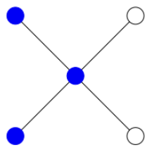
Có 1 FFD trung tâm, các FFD hoặc RFD sẽ kết nối tới FFD trung tâm này.
<br><br><br><br>

### 4.2.2. Peer-to-Peer Topology 

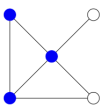 

Một node có thể trao đổi dữ liệu với PAN coordinator trung tâm hoặc thông qua các node FFD khác thông qua kết nối Peer to Peer.
<br><br><br><br>

### 4.2.3. Cluster Tree Topology

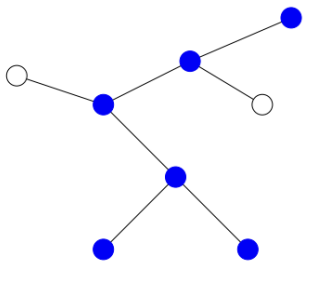 

Các node rìa giao tiếp với coordinators (FFDs). Có 1 PAN Coordinator duy nhất trong mạng.
<br><br><br><br>

## 4.3.Frame format

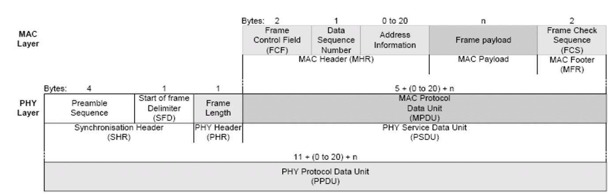 

### 4.3.1.MAC Layer Frame format:

Được chia thành 4 loại MAC Frame chính:

**- Beacon Frames:** frame do coordinate broadcast để thiết lập network.

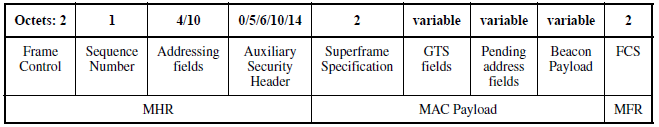

**- Command Frames:** dùng để chỉ thị lệnh: kết hợp/phân tách mạng (association/disassociation network), data and beacon request, thông báo xung đột,…

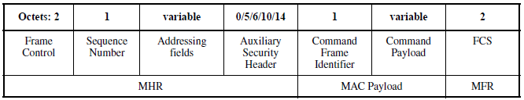 

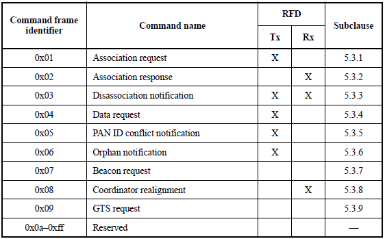 

**- Data Frames:** frame mang data là các Ipv6 packets đang được truyền/nhận.

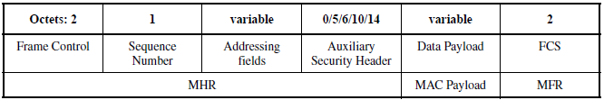 

**- Acknowledgements frames:** dùng để xác nhận việc nhận frame có thành công hay không.

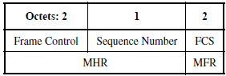 

**Frame control (2 bytes):** xác định các định dạng của frame, có cấu trúc như sau:

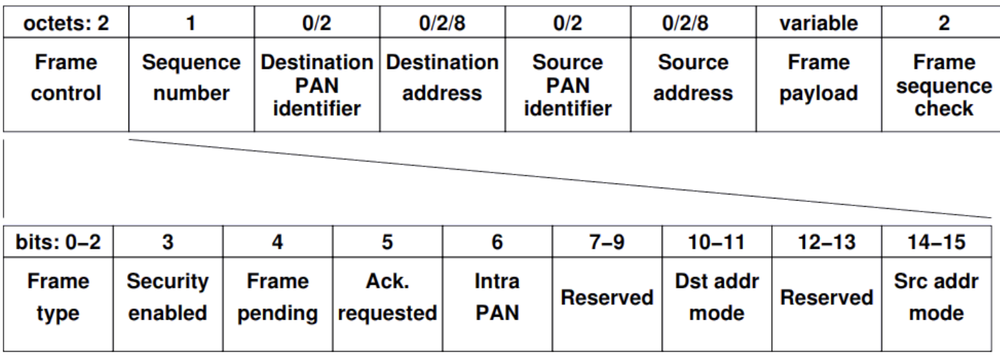 

- Frame type (0-2):
  - Beacon      000
  - Data        001
  - Command     011
  - Ack         010

- Security enable (3):
    - False     0
    - True      1

- Frame pending (4):
  - False       0
  - True        1

- Acknowledge request (5):
  - False       0
  - True        1

- Intra-PAN (6):
  - False       0
  - True        1

- Destination addressing mode (10-11):
  - None            00
  - Short/16-bit    10

- Frame version (12-13):
  - 0          00

- Source addressing mode (14-15):
  - None            00
  - Short/16-bit    10

**Beacon Frame:**
```
IEEE 802.15.4 Beacon, Src: 0x0000
    Frame Control Field: Beacon (0x8000)
        .... .... .... .000 = Frame Type: Beacon (0x0000)
        .... .... .... 0... = Security Enabled: False
        .... .... ...0 .... = Frame Pending: False
        .... .... ..0. .... = Acknowledge Request: False
        .... .... .0.. .... = Intra-PAN: False
        .... 00.. .... .... = Destination Addressing Mode: None (0x0000)
        ..00 .... .... .... = Frame Version: 0
        10.. .... .... .... = Source Addressing Mode: Short/16-bit (0x0002)
    Sequence Number: 99
    Source PAN: 0x01ff
    Source: 0x0000
    Superframe Specification
        .... .... .... 1111 = Beacon Interval: 15
        .... .... 1111 .... = Superframe Interval: 15
        .... 1111 .... .... = Final CAP Slot: 15
        ...0 .... .... .... = Battery Extension: False
        .1.. .... .... .... = PAN Coordinator: True
        1... .... .... .... = Association Permit: True
    GTS
        GTS Descriptor Count: 0
        GTS Permit: False
    Pending Addresses: 0 Short and 0 Long
ZigBee Beacon
    Protocol ID: 0
    Stack Profile: Network Specific (0x00)
    Protocol Version: 2
    Router Capacity: True
    Device Depth: 0
    End Device Capacity: True
    Extended PAN ID: Miniware\_6f:73:6e:65:73 (00:00:72:6f:73:6e:65:73)
    Tx Offset: 16777215
    Update ID: 0
0000  00 80 63 ff 01 00 00 ff cf 00 00 00 20 84 73 65   ..c......... .se
0010  6e 73 6f 72 00 00 ff ff ff 00                     nsor......
```


**Data Frame:**

```
IEEE 802.15.4 Data, Dst: Broadcast, Src: 0x2c4d
    Frame Control Field: Data (0x8841)
        .... .... .... .001 = Frame Type: Data (0x0001)
        .... .... .... 0... = Security Enabled: False
        .... .... ...0 .... = Frame Pending: False
        .... .... ..0. .... = Acknowledge Request: False
        .... .... .1.. .... = Intra-PAN: True
        .... 10.. .... .... = Destination Addressing Mode: Short/16-bit (0x0002)
        ..00 .... .... .... = Frame Version: 0
        10.. .... .... .... = Source Addressing Mode: Short/16-bit (0x0002)
    Sequence Number: 14
    Destination PAN: 0x01ff
    Destination: 0xffff
    Source: 0x2c4d
    [Extended Source: ExeginTe\_ff:ff:00:20:07 (00:1c:da:ff:ff:00:20:07)]
    [Origin: 23]
ZigBee Network Layer Data, Dst: Broadcast, Src: 0x2c4d
    Frame Control Field: Data (0x0248)
        .... .... .... ..00 = Frame Type: Data (0x0000)
        .... .... ..00 10.. = Protocol Version: 2
        .... .... 01.. .... = Discover Route: Enable (0x0001)
        .... ...0 .... .... = Multicast: False
        .... ..1. .... .... = Security: True
        .... .0.. .... .... = Source Route: False
        .... 0... .... .... = Destination: False
        ...0 .... .... .... = Extended Source: False
    Destination: 0xfffd
    Source: 0x2c4d
    Radius: 30
    Sequence Number: 123
    [Extended Source: ExeginTe\_ff:ff:00:20:07 (00:1c:da:ff:ff:00:20:07)]
    [Origin: 19]
    ZigBee Security Header
        Security Control Field
            ...0 1... = Key Id: Network Key (0x01)
            ..1. .... = Extended Nonce: True
        Frame Counter: 0
        Extended Source: ExeginTe\_ff:ff:00:20:07 (00:1c:da:ff:ff:00:20:07)
        Key Sequence Number: 0
        Message Integrity Code: 9376f9f8
        [Expert Info (Warn/Undecoded): Encrypted Payload]
            [Message: Encrypted Payload]
            [Severity level: Warn]
            [Group: Undecoded]
    Data (20 bytes)
        Data: 31316d646805adc32b8eafa8e32b726e3bb5a52e
        [Length: 20]
0000  41 88 0e ff 01 ff ff 4d 2c 48 02 fd ff 4d 2c 1e   A......M,H...M,.
0010  7b 28 00 00 00 00 07 20 00 ff ff da 1c 00 00 31   {(..... .......1
0020  31 6d 64 68 05 ad c3 2b 8e af a8 e3 2b 72 6e 3b   1mdh...+....+rn;
0030  b5 a5 2e 93 76 f9 f8                              ....v..
```

**Command Frame:**
```
IEEE 802.15.4 Command, Dst: 0x0000, Src: ExeginTe\_ff:ff:00:20:07
    Frame Control Field: Command (0xc823)
        .... .... .... .011 = Frame Type: Command (0x0003)
        .... .... .... 0... = Security Enabled: False
        .... .... ...0 .... = Frame Pending: False
        .... .... ..1. .... = Acknowledge Request: True
        .... .... .0.. .... = Intra-PAN: False
        .... 10.. .... .... = Destination Addressing Mode: Short/16-bit (0x0002)
        ..00 .... .... .... = Frame Version: 0
        11.. .... .... .... = Source Addressing Mode: Long/64-bit (0x0003)
    Sequence Number: 12
    Destination PAN: 0x01ff
    Destination: 0x0000
    Source PAN: 0xffff
    Extended Source: ExeginTe\_ff:ff:00:20:07 (00:1c:da:ff:ff:00:20:07)
    Command Identifier: Association Request (0x01)
    Association Request
        .... ...0 = Alternate PAN Coordinator: False
        .... ..1. = Device Type: True (FFD)
        .... .1.. = Power Source: True (AC/Mains Power)
        .... 1... = Receive On When Idle: True
        .1.. .... = Security Capability: True
        1... .... = Allocate Address: True
0000  23 c8 0c ff 01 00 00 ff ff 07 20 00 ff ff da 1c   #......... .....
0010  00 01 ce                                          ...
Acknowledge Frame:
IEEE 802.15.4 Ack, Sequence Number: 12
    Frame Control Field: Ack (0x0002)
        .... .... .... .010 = Frame Type: Ack (0x0002)
        .... .... .... 0... = Security Enabled: False
        .... .... ...0 .... = Frame Pending: False
        .... .... ..0. .... = Acknowledge Request: False
        .... .... .0.. .... = Intra-PAN: False
        .... 00.. .... .... = Destination Addressing Mode: None (0x0000)
        ..00 .... .... .... = Frame Version: 0
        00.. .... .... .... = Source Addressing Mode: None (0x0000)
    Sequence Number: 12
0000  02 00 0c
```


### 4.3.2. MAC Layer channel access

MAC Layer của IEEE 802.15.4 vận hành theo giao thức CSMA/CA – Carrier Sense Multiple Access/Conllisioni Avoidance

- Trước khi gửi dữ liệu, mỗi node sẽ lắng nghe đường truyền, nếu đường truyền đang ở idle (đo mức năng lượng thu nhỏ hơn hoặc bằng mức nhiễu).
- Khi xác nhận kênh truyền đang idle, bắt đầu gửi data frame sau một khoảng thời gian ngẫu nhiên (random backofff interval).
- Nếu phía node nhận đã nhận được data frame thành công, node nhận sẽ gửi trả lại cho node gửi một ack frame.
- Nếu phía node nhận không nhận được ack frame, node gửi bắt đầu gửi lại data frame.

Phương pháp CSMA/CA giúp tránh xung đột kênh truyền.