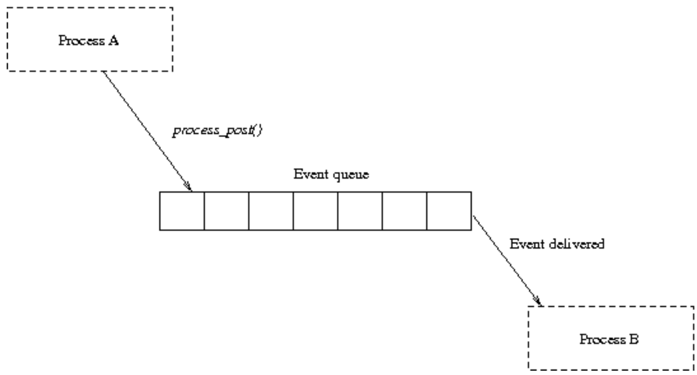
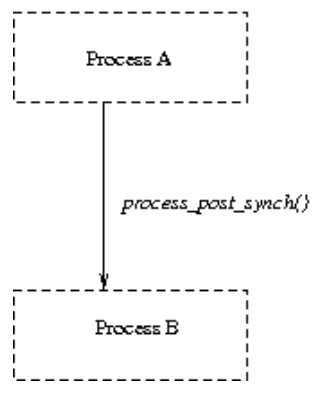

# Events

Trong Contiki OS, một process được chạy khi nó nhận được một event. Có hai loại event: `asynchronous events` và `synchronous events`

### Asychronous Events



Asynchronous Events sẽ được chuyển đến cho process nhận sau một khoảng thời gian event đó được post.
Khi event được post, nó sẽ được thêm vào cuối `event queue` trong Contiki kernel. Kernel sẽ liên tục check trong event queue và chuyển event cho process tương ứng bằng cách gọi process.

Các process nhận event có thể là một process được chỉ định, hoặc tất cả các process. Khi event được gửi đến toàn bộ process, nó sẽ gửi tuần tự theo thứ tự các process nhận.

Asynchronous Event được post bởi hàm `process_post()`, thực hiện check size của queue, nếu queue đầy thì return error, nếu queue còn chỗ trống thì thêm event vào cuối queue và return.

### Synchronous Events



Synchronous Events sẽ được chuyển đến process ngay lập tức khi event được post, và chỉ có thể đươch post đến một process duy nhất.

Khi một process post một synchronous event, ngay lập tức kernel sẽ gọi process nhận, process đã post event sẽ bị block đến khi process nhận thực thi xong.

### Polling

Poll request là một loại event đặc biệt, một process được poll khi gọi hàm `process_poll()`. Khi gọi hàm này và truyền vào tên của process đó, scheduler sẽ ưu tiên lập lịch cho process đó hoạt động sớm nhất có thể. Process sẽ được post một event đặc biệt để thông báo rằng process đó đã được poll.

Polling là cách để thực hiện ngay một process khi xảy ra ngắt và hàm này an toàn khi dùng trong ngắt.

### Event Identifiers

Một event được xác định bởi một mã Event Identifiers. Event Identifier là một số 8-bit được truyền vào process nhận event, cho phép process phân biệt được event nào đã xảy ra và hành động nào cần thực hiện ứng với event đó.

Giá trị của Event Identifiers dưới `127` có thể sử dụng trong các process của người dùng, còn trên `128` sẽ được sử dụng giữa các process khác nhau và được quản lý bởi kernel.

*Các Event Identifirers được quản lý bởi kernel:*

```C
#define PROCESS_EVENT_NONE      128
#define PROCESS_EVENT_INIT      129
#define PROCESS_EVENT_POLL      130
#define PROCESS_EVENT_EXIT      131
#define PROCESS_EVENT_CONTINUE  133
#define PROCESS_EVENT_MSG       134
#define PROCESS_EVENT_EXITED    135
#define PROCESS_EVENT_TIMER     136
```

- `PROCESS_EVENT_NONE`: This event identifier is not used.
- `PROCESS_EVENT_INIT`: This event is sent to new processes when they are initiated.
- `PROCESS_EVENT_POLL`: This event is sent to a process that is being polled.
- `PROCESS_EVENT_EXIT`: This event is sent to a process that is being killed by the kernel. The process may choose to clean up any allocated resources, as the process will not be invoked again after receiving this event.
- `PROCESS_EVENT_CONTINUE`: This event is sent by the kernel to a process that is waiting in a `PROCESS_YIELD()` statement.
- `PROCESS_EVENT_MSG`:  This event is sent to a process that has received a communication message. It is typically used by the IP stack to inform a process that a message has arrived, but can also be used between processes as a generic event indicating that a message has arrived.
- `PROCESS_EVENT_EXITED`: : This event is sent to all processes when another process is about to exit. A pointer to the process control block of the process that is existing is sent along the event. When receiving this event, the receiving processes may clean up state that was allocated by the process that is about to exit.
- `PROCESS_EVENT_TIMER`: This event is sent to a process when an event timer (etimer) has expired.

