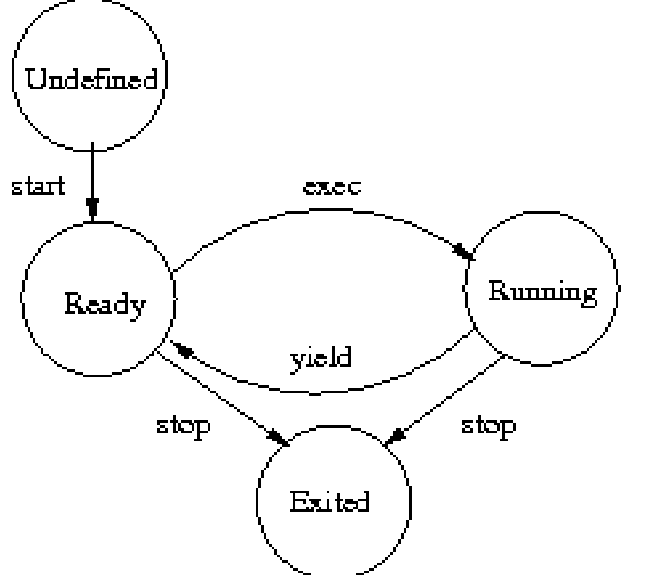

# Multithreading

Contiki hỗ trợ các threads có mức độ ưu tiên thông qua `sys/mt.h` library. `mt thread` có stack segment và program counter `PC` riêng được lưu trữ khi chuyển đổi bối cảnh của thread `thread context`. Library này có cả phần phụ thuộc vào kiến trúc và phần không phụ thuộc vào kiến trúc, người code application chỉ cần sử dụng phần không phụ thuộc vào kiến trúc trong multithreading library.

Mỗi thread được khai báo với một object có loại `struct mt_thread`:

```C
struct mt_thread 
{
    int state;
    process_event_t *evptr;
    process_data_t *dataptr;
    struct mtarch_thread thread;
}
```



Mô hình trên là giản đồ trạng thái (state chart) của threads. Một thread có thể ở một trong ba state trong suốt thời gian hoạt động. Thread được bắt đầu bằng hàm `mt_start()`, mt library set state của thread đó là `M_STATE_READY`. State này cho biết thread đang chuẩn bị thực thi, chuyển thread qua running state bằng cách sử dụng hàm `mt_exec()`, chuyển lại sử dụng hàm `mt_yield()`. `MT_STATE_RUNNING` là state của thread ở running, `MT_STATE_WAITING` và `MT_STATE_PEEK` hiện tại không được dùng. `MT_STATE_EXITED` là trạng thái cuối cùng của thread, thread không còn được thực thi tiếp nữa.

`thread` variable của type `struct mtarch_thread` được thiết kế cho trạng thái của kiến trúc, thông thường sẽ là bối cảnh thực thi của thread.

`evptr` và `dataptr` hiện không được sử dụng bởi tất cả triển khai của multithreading library.

### Programming Threads

*Multithreading API:*

`void mt_init(void)` : Initializes the library.
`void mt_remove(void)` : Uninstalls the library.
`void mt_start(struct mt_thread *thread, void (* function)(void *), void *data)` : Starts a thread.
`void mt_exit(void)` : Exits a thread.
`void mt_exec(struct mt_thread *thread)` : Execute as thread.
`void mt_yield(void)` : Release control voluntarily.
`void mt_stop(struct mt_thread *thread)` : Stops a thread.

### Starting and Stopping

`void mt_start(struct mt_thread *thread, void (* function)(void *), void *data)` : Starts a thread.

- `struct mt_thread *thread` : con trỏ trỏ đến bộ nhớ được phân bổ nhưng chưa được khởi tạo, trong đó `mt_start()` sẽ đặt trạng thái bên trong vùng nhớ đó được sử dụng cho các hàm multithreading.
- `void (* function)(void *)` : là một function pointer trỏ đến hàm sẽ được thực thi.
- `void *data` : con trỏ trỏ đến dữ liệu sẽ được truyền vào hàm khi thread started. 

`void mt_stop(struct mt_thread *thread)` : Stops a thread. Sau khi gọi hàm này, dữ liệu của object `struct mt_thread` không còn được sử dụng và không được gọi trong process nữa.

### Scheduling

Sau khi thread được bắt đầu, nó sẽ được thực thi cho đến khi bị hệ thống chiến quyền ưu tiên hoặc tự gọi hàm `mt_yield()`. Ưu tiên sẽ được kiểm soát bởi hệ thống, vì vậy nó nằm ngoài lớp lập trình API. Mặt khác, yielding là một hành động được phát sinh trong thread, system sẽ thực hiện tiếp main system thread và hoãn thực hiện thread đó đã gọi hafm``mt_yield()`.

Khi hàm `mt_exec()` được gọi lần đầu trên một thread, nó sẽ gọi hàm trong đối số thứ hai của hàm `mt_start()` trỏ tới. Các lần gọi hàm `mt_exec()` sau sẽ khôi phục context và tiếp thục thực thi từ nơi mà thread dừng lại ở lần cuối.

*Ví dụ: tạo một thread từ một Contiki process*

```C
void
thread_entry(void *data)
{
    for(;;) 
    {
        printf("Looping in thread_entry\n");
        mt_yield();
    }
}
PROCESS_THREAD(mt_process, event, data)
{
    static struct mt_thread thread;
    static int counter;
    PROCESS_BEGIN();
    mt_start(&thread, thread_entry, NULL);
    for(;;) 
    {
        PROCESS_PAUSE();
        mt_exec(&thread);
        if(++counter == 10) 
        {
            printf("Stopping the thread after %d calls\n", counter);
            mt_stop(&thread);
            break;
        } 
    }
    PROCESS_END();
}
```